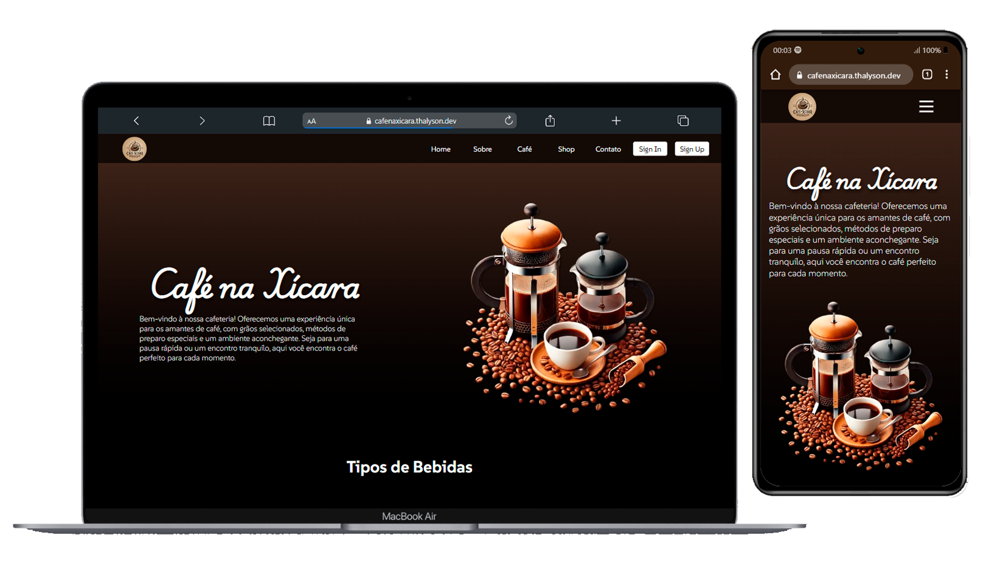
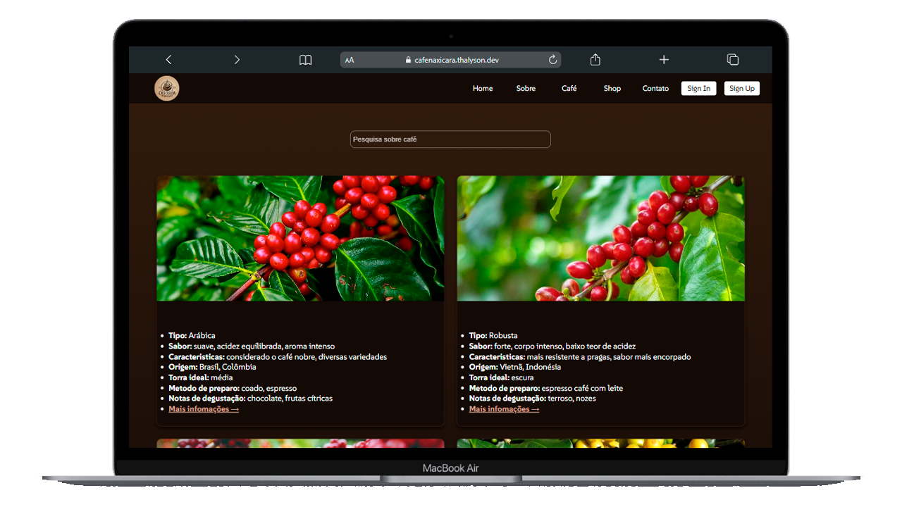
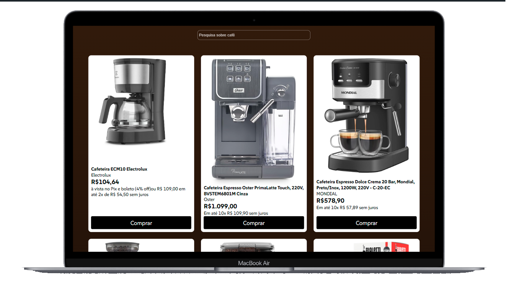

# Café na Xícara


Link do projeto:
<a href="https://cafenaxicara.thalyson.dev/" target="_blank">Visite o cafenaxicara.thalyson.dev</a>

## Sobre o Projeto

O projeto **Café na Xícara** é um site dedicado aos amantes de café, oferecendo informações sobre diferentes tipos de café, bebidas, uma loja de itens relacionados, área de cadastro e login.

## Capturas de Tela





## Funcionalidades

- **Galeria de Bebidas de Café**: Apresenta uma galeria de bebidas à base de café com imagens e detalhes de cada uma.
- **Pesquisa de Café**: Pesquise por diferentes tipos de café com base em características como sabor, origem e métodos de preparo.
- **Links Externos**: Links para mais informações sobre cada tipo de café.
- **Loja**: Itens como cafeteiras, cafés e acessórios.
- **Login**: Acesso a itens salvos (em desenvolvimento).
- **Cadastro**: Criar conta para salvar tipos de café e itens (em desenvolvimento).

## Pré-requisitos

- Node.js (versão v22.11.0 ou superior)
- npm (versão 10.9.0 ou superior)

## Instalação

1. Clone o repositório

   ```bash
   git clone https://github.com/ThalysonRibeiro/cafe-na-xicara-vr.git
   ```

2. Navegue até o diretório do projeto
   ```bash
   cd cafe-na-xicara-vr
   ```
3. Instale as dependências

```bash
npm install
```

4.  Inicie o servidor de desenvolvimento

```bash
npm start
```

## Scripts Disponíveis

No diretório do projeto, você pode executar:

`npm start:` Inicia o servidor de desenvolvimento
`npm run build:` Compila o aplicativo para produção
`npm test:` Executa os testes
`npm run eject:` Remove a configuração de build única
`npm run format:` Formata o código usando Prettier

## Tecnologias Utilizadas

**ReactJs (v18.3.1):** Biblioteca para construção de interfaces de usuário
**React Router (v7.0.2):** Roteamento de páginas
**Prettier:** Formatação de código
**React Testing Library:** Testes de componentes
**Web Vitals:** Métricas de performance

## Dependências

**Principais**

- **react**
- **react-dom**
- **react-router-dom**
- **react-scripts**

## Dependências de Desenvolvimento

- **prettier**
- **@testing-library/react**
- **@testing-library/jest-dom**

## Roadmap

- [ ] Implementar autenticação completa
- [ ] Adicionar carrinho de compras
- [ ] Desenvolver sistema de avaliação de cafés
- [x] Implementar modo responsivo para dispositivos móveis

## Contribuições

**Contribuições são bem-vindas! Para contribuir:**

1. Faça um fork do projeto
2. Crie uma branch para sua feature
3. Commit suas alterações
4. Faça um push para a branch
5. Abra um Pull Request

Dica: Use npm run format para garantir a padronização do código.
Licença
Este projeto está sob licença MIT.
